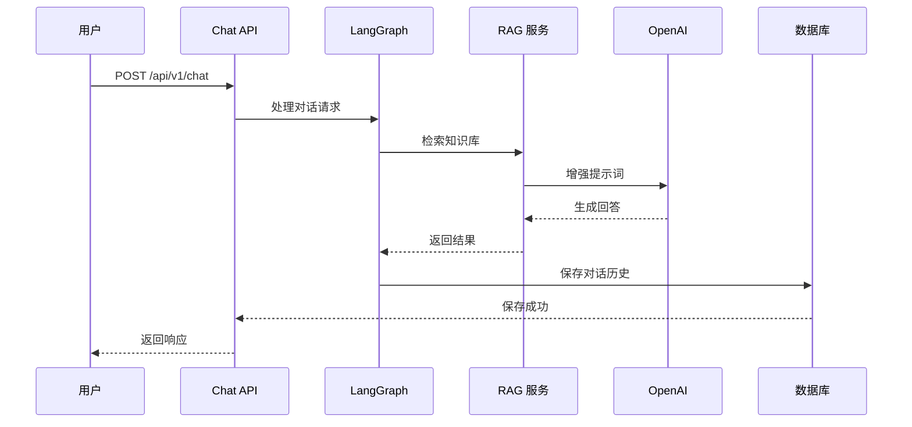
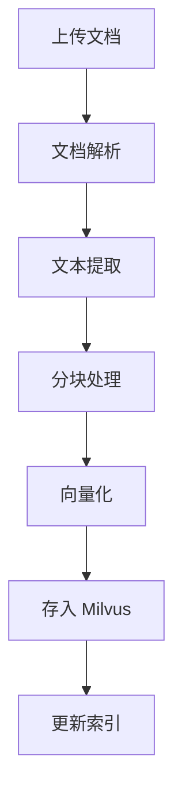

# 🏗️ 系统架构设计

本文档介绍 AI Customer Service Bot 的系统架构设计。

## 📊 整体架构

```
┌─────────────────────────────────────────────────────────────────┐
│                         客户端层                                   │
│  ┌──────────┐  ┌──────────┐  ┌──────────┐  ┌──────────────────┐ │
│  │ Web APP  │  │  Mobile  │  │  API    │  │ Third-party      │ │
│  └──────────┘  └──────────┘  └──────────┘  └──────────────────┘ │
└─────────────────────────────────────────────────────────────────┘
                                 │
                                 ▼
┌─────────────────────────────────────────────────────────────────┐
│                        Nginx / 反向代理                          │
│              (SSL 终止、负载均衡、静态文件服务)                      │
└─────────────────────────────────────────────────────────────────┘
                                 │
                                 ▼
┌─────────────────────────────────────────────────────────────────┐
│                       FastAPI 应用层                              │
│  ┌──────────┐  ┌──────────┐  ┌──────────┐  ┌──────────────────┐ │
│  │  Chat    │  │Knowledge │  │ History │  │   Health         │ │
│  │  API     │  │  API     │  │  API    │  │   Check          │ │
│  └──────────┘  └──────────┘  └──────────┘  └──────────────────┘ │
│                                                                 │
│  ┌──────────────────────────────────────────────────────────┐   │
│  │              LangGraph 工作流引擎                        │   │
│  │  ┌─────────┐  ┌─────────┐  ┌─────────┐  ┌─────────┐   │   │
│  │  │ Intent  │→│ Retrieval│→│  LLM    │→│ Response │   │   │
│  │  │  Router │  │  Engine │  │  Chain  ││  Builder │   │   │
│  │  └─────────┘  └─────────┘  └─────────┘  └─────────┘   │   │
│  └──────────────────────────────────────────────────────────┘   │
└─────────────────────────────────────────────────────────────────┘
                                 │
                                 ▼
┌──────────────────┐  ┌──────────────────┐  ┌──────────────────┐
│   Milvus         │  │   PostgreSQL     │  │   Redis          │
│   (向量数据库)     │  │   (关系数据库)    │  │   (缓存)         │
└──────────────────┘  └──────────────────┘  └──────────────────┘
                                 │
                                 ▼
┌─────────────────────────────────────────────────────────────────┐
│                        外部服务                                    │
│  ┌──────────┐  ┌──────────┐  ┌──────────┐  ┌────────────────┐ │
│  │  OpenAI  │  │  Claude  │  │  Gemini  │  │  Stormglass   │ │
│  │  GPT-4   │  │  Claude  │  │  Gemini  │  │  Weather API  │ │
│  └──────────┘  └──────────┘  └──────────┘  └────────────────┘ │
└─────────────────────────────────────────────────────────────────┘
```

---

## 🔑 核心组件

### 1. FastAPI 应用层

| 组件 | 职责 | 技术 |
|------|------|------|
| Chat API | 处理对话请求，返回智能回答 | FastAPI, Pydantic |
| Knowledge API | 知识库文档管理 | FastAPI, 文件处理 |
| History API | 对话历史管理 | FastAPI, CRUD |
| Health API | 健康检查 | FastAPI |

### 2. LangGraph 工作流引擎

```python
# 工作流节点定义
nodes = {
    "intent_router": "意图识别和路由",
    "retrieval": "向量检索",
    "llm_chain": "LLM 对话链",
    "response_builder": "响应构建",
    "history_manager": "历史管理"
}

# 工作流边定义
edges = {
    "intent_router → retrieval": "检索意图",
    "intent_router → llm_chain": "直接回答",
    "retrieval → llm_chain": "检索结果",
    "llm_chain → response_builder": "LLM 输出",
    "response_builder → history_manager": "保存历史"
}
```

### 3. RAG 检索增强系统

```
用户输入
    │
    ▼
┌─────────┐
│  Query  │  查询处理
│ Transform│
└────┬────┘
     │
     ▼
┌─────────┐
│  Vector │  向量检索（Milvus）
│  Search │
└────┬────┘
     │
     ▼
┌─────────┐
│ Context │  上下文组合
│ Combine │
└────┬────┘
     │
     ▼
┌─────────┐
│   LLM   │  生成回答
│  Prompt │
└─────────┘
```

---

## 📁 数据流设计

### 对话请求流程



### 知识库更新流程



---

## 🗄️ 数据存储设计

### PostgreSQL 表结构

```sql
-- 对话会话表
CREATE TABLE sessions (
    id VARCHAR(64) PRIMARY KEY,
    user_id VARCHAR(64),
    title VARCHAR(255),
    created_at TIMESTAMP DEFAULT NOW(),
    updated_at TIMESTAMP DEFAULT NOW()
);

-- 对话消息表
CREATE TABLE messages (
    id SERIAL PRIMARY KEY,
    session_id VARCHAR(64) REFERENCES sessions(id),
    role VARCHAR(20),  -- 'user' | 'assistant'
    content TEXT,
    metadata JSONB,
    created_at TIMESTAMP DEFAULT NOW()
);

-- 知识库文档表
CREATE TABLE documents (
    id VARCHAR(64) PRIMARY KEY,
    filename VARCHAR(255),
    category VARCHAR(64),
    status VARCHAR(20),  -- 'processing' | 'ready' | 'error'
    file_path VARCHAR(512),
    chunk_count INT,
    created_at TIMESTAMP DEFAULT NOW()
);
```

### Milvus Collection 设计

```python
# 知识库向量集合
collection_schema = {
    "collection_name": "knowledge_base",
    "fields": [
        {"name": "id", "type": "Int64", "is_primary": True},
        {"name": "vector", "type": "FloatVector", "dim": 1536},
        {"name": "text", "type": "VARCHAR", "max_length": 4096},
        {"name": "document_id", "type": "VARCHAR", "max_length": 64},
        {"name": "metadata", "type": "JSON"}
    ],
    "index_params": [
        {"index_type": "HNSW", "metric_type": "COSINE"},
        {"index_type": "IVF_FLAT", "metric_type": "COSINE"}
    ]
}
```

---

## 🔒 安全设计

### 1. 认证和授权

```python
# JWT Token 验证
async def verify_token(token: str):
    try:
        payload = jwt.decode(token, SECRET_KEY, algorithms=[ALGORITHM])
        return payload
    except JWTError:
        raise HTTPException(status_code=401)
```

### 2. API 速率限制

```python
from slowapi import Limiter

limiter = Limiter(key_func=get_remote_address)

@app.post("/api/v1/chat")
@limiter.limit("100/minute")
async def chat(request: Request):
    # ...
```

### 3. 数据加密

- **传输层**: HTTPS/TLS 加密
- **存储层**: PostgreSQL TDE（可选）
- **敏感数据**: 环境变量加密存储

---

## 📈 扩展性设计

### 水平扩展

```
                    ┌──────────────┐
                    │   Nginx      │
                    │  Load Balancer│
                    └──────┬───────┘
                           │
        ┌──────────────────┼──────────────────┐
        │                  │                  │
        ▼                  ▼                  ▼
┌─────────────┐   ┌─────────────┐   ┌─────────────┐
│  App Pod 1  │   │  App Pod 2  │   │  App Pod 3  │
│  (FastAPI)   │   │  (FastAPI)  │   │  (FastAPI)  │
└──────┬──────┘   └──────┬──────┘   └──────┬──────┘
       │                  │                  │
       └──────────────────┼──────────────────┘
                          │
                    ┌──────┴──────┐
                    │   Redis      │
                    │   (Session)  │
                    └──────────────┘
```

### 垂直扩展建议

| 组件 | 扩展策略 |
|------|----------|
| FastAPI | 增加 worker 进程数 |
| Milvus | 增加内存、使用 GPU 版本 |
| PostgreSQL | 增加连接数、优化查询 |
| Redis | 集群模式 |

---

## 🚀 性能指标目标

| 指标 | 目标值 |
|------|--------|
| API 响应时间 | < 500ms (P95) |
| 并发连接数 | 100+ |
| 向量检索 | < 100ms |
| 可用性 | 99.9% |
| 每日调用量 | 10,000+ |

---

## 📞 架构演进路线

```
v0.1.0 (当前)          v0.2.0              v1.0.0
   │                     │                  │
   ▼                     ▼                  ▼
单实例部署 ──→ 负载均衡集群 ──→ 微服务拆分
   │                     │                  │
   ▼                     ▼                  ▼
单一数据库 ──→ 主从复制 ──→ 分库分表
   │                     │                  │
   ▼                     ▼                  ▼
基础 RAG ──→ 优化 RAG ──→ 多模型混合
```

---

## 📚 相关文档

- [快速开始](../README.md)
- [API 文档](API.md)
- [部署指南](DEPLOYMENT.md)
- [使用指南](USER_GUIDE.md)
